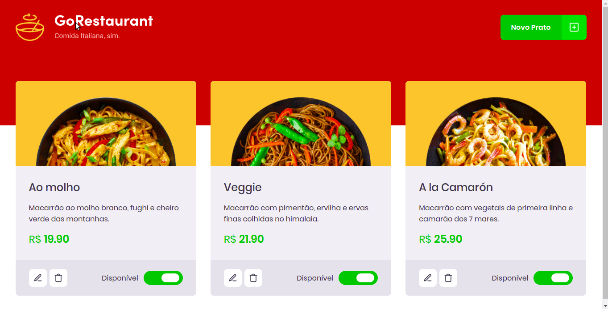

# Desafio 10: GoRestaurant Web

Aplicação web desenvolvida com ReactJS junto com TypeScript, a GoRestaurant.



## :rocket: Sobre o desafio

O objetivo é praticar o que fora aprendido até agora no ReactJS junto com TypeScript, praticando o conceito de CRUD (Create, Read, Update, Delete).

Essa será uma aplicação que irá se conectar a uma fake API, e exibir os pratos de comida criados e permitir a criação, remoção e atualização desses pratos.

## Utilizando uma fake API

Antes de tudo, para que você tenha os dados para exibir em tela, criamos um arquivo que você poderá utilizar como fake API para te prover esses dados.

Para isso, deixamos instalado no seu package.json uma dependência chamada `json-server`, e um arquivo chamado `server.json` que contém os dados para uma rota `/foods`. Para executar esse servidor você pode executar o seguinte comando:

```js
  yarn json-server server.json -p 3333
```

## Funcionalidades da aplicação

Os arquivos da pasta `src` que não tinham código foram completados para atingir os objetivos de cada rota.

- **`Listar os pratos de comida da sua API`**: A página `Dashboard` deve ser capaz de exibir uma listagem, com o campo `title`, `value`, e `description` e `available` de todos os pratos de comida que estão cadastrados na API.

- **`Adicionar novos pratos de comida a sua API`**: Na página Dashboard deve abrir um modal ao clicar no botão `Novo Prato` no Header. Esse modal deve ser responsável por cadastrar uma nova `food` passando os campos `image`, `name`, `description`, `value`.

**Dica**: O campo image deve ser uma URL.

- **`Editar pratos de comida da sua API`**: Na página Dashboard deve abrir um modal ao clicar no botão `Editar Prato`. Esse modal deve ser responsável por editar uma `food` passando os campos `image`, `name`, `description`, `value`.

- **`Remover pratos de comida da sua API`**: Na página Dashboard deve remover um prato de comida ao clicar no botão com ícone de lixeira no componente Food.

- **`Alterar disponibilidade dos pratos de comida da sua API`**: Na página Dashboard deve alterar a disponibilidade de um prato de comida ao clicar no switch que é controlado pelo valor de `available`.

### Específicação dos testes

Para esse desafio, temos os seguintes testes:

- **`should be able to list all the food plates from your api`**: Para que esse teste passe, sua aplicação deve permitir que sejam listados, toda os pratos de comidas que são retornadas da sua fake API.

* **`should be able to add a new food plate`**: Para que esse teste passe, você deve permitir que um prato de comida seja adicionado a sua api, adicionando-o também à listagem.

* **`should be able to edit a food plate`**: Para que esse teste passe, você deve permitir que um prato de comida seja editado na sua api, editando-o também na listagem.

* **`should be able to remove a food plate`**: Para que esse teste passe, você deve permitir que um prato de comida seja removido da sua api, removendo-o também da listagem.

* **`should be able to update the availibility of a food plate`**: Para que esse teste passe, em sua dashboard você deve permitir que o status do prato de comida seja alterado entre `Disponível` e `Indisponível`;

## :calendar: Entrega

Esse desafio foi entregue pela plataforma Skylab da Rocketseat.

## :computer: Rodar a aplicação

Para rodar a aplicação, basta seguir as instruções abaixo:

```bash
# Clone this repository
$ git clone https://github.com/marciofrancalima/desafio-reactjs-crud.git (or use ssh)

# Go into the repository
$ cd desafio-reactjs-crud

# Install dependencies
$ yarn install

# Run the fake API
$ yarn json-server server.json -p 3333

# Run the app
$ yarn start
```

---

Made with 💜 by Márcio França Lima. [Contact me](https://www.linkedin.com/in/m%C3%A1rcio-fran%C3%A7a-lima-916454187/)
